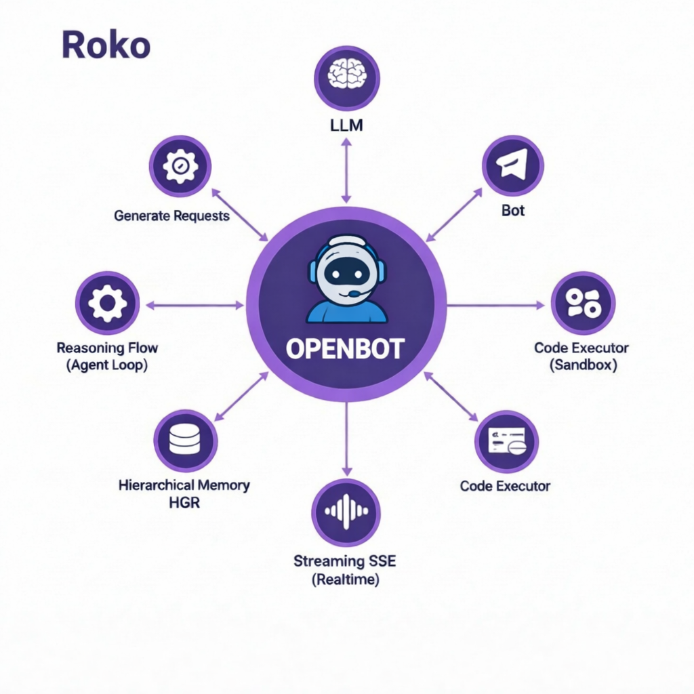

<p align="center">
  
</p>

# OPENBOT - Autonomous AI System

   

---

## 🚀 Overview

OPENBOT is an advanced autonomous artificial intelligence system with natural language processing capabilities, persistent cognitive memory, and a modern web interface. The system is designed to offer intelligent and contextual interactions through a modular and scalable architecture. It supports multiple AI providers (OpenAI, DeepSeek, Groq, Anthropic), integrates 40 diverse tools, features a Hierarchical Generative Reasoning (HGR) memory system, and provides an asynchronous REST API.

## ✨ Key Features

*   **Modern Web Interface:** Responsive and elegant interface built with Flask and Tailwind CSS (via `WEB/index.html`).
*   **Cognitive Memory (HGR):** Long-term memory system with semantic search using FAISS and a 3-level hierarchical structure for immediate, active, and persistent context management.
*   **Secure Authentication:** Complete user authentication system using JWT and bcrypt for secure access to API endpoints.
*   **Parallel Processing:** Optimized pipeline for multi-provider AI interactions and tool execution.
*   **Multi-Provider Support:** Seamless integration with OpenAI, DeepSeek, Groq, and Anthropic APIs.
*   **Extensive Toolset:** Access to 40 specialized tools across categories like Python, Shell, Network, Filesystem, Data, System, Crypto, Utility, and Memory.
*   **Asynchronous REST API:** High-performance API built with Quart for efficient communication and real-time interactions.

---

## ⚡ Quick Start

To get OPENBOT up and running, follow these simple steps:

```bash
# 1. Instalar dependências
bash install.sh

# 2. Iniciar o servidor
python openbot.py

# 3. Registrar e fazer login
curl -X POST http://localhost:5000/api/auth/register \
  -H "Content-Type: application/json" \
  -d '{"username":"usuario","password":"Senha@123","email":"eu@email.com"}'

curl -X POST http://localhost:5000/api/auth/login \
  -H "Content-Type: application/json" \
  -d '{"username":"usuario","password":"Senha@123"}'

# 4. Usar o chat (substituir TOKEN pelo token recebido)
curl -X POST http://localhost:5000/api/chat \
  -H "Authorization: Bearer TOKEN" \
  -H "Content-Type: application/json" \
  -d '{"message":"Qual é o IP do google.com?"}'
```

---

## 📂 Project Structure

```text
OPENBOT/
├── BOT/
│   ├── openbot.py          — Main server (Quart + agent loop)
│   ├── HGR.py              — Hierarchical memory system (3 levels)
│   ├── auth_system.py      — JWT + bcrypt authentication
│   ├── config.py           — Centralized configuration
│   ├── openbot_cors.py     — Entry point with CORS enabled
│   └── install.sh          — Automatic installation script
├── DOCUMENT/
│   └── OPENBOT_Documentacao.docx — Detailed documentation
├── WEB/
│   └── index.html          — Web Interface
├── LICENSE                 — Apache 2.0 License
└── README.md               — Project overview and documentation
```

---

## ⚙️ Environment Variables

Configure OPENBOT using the following environment variables:

| Variável | Descrição | Padrão |
|---|---|---|
| `OPENBOT_PROVIDER` | Active provider (`deepseek`, `groq`, `openai`, `anthropic`) | `deepseek` |
| `OPENBOT_MODEL` | LLM model | Provider's default |
| `DEEPSEEK_API_KEY` | DeepSeek API Key | — |
| `GROQ_API_KEY` | Groq API Key | — |
| `OPENAI_API_KEY` | OpenAI API Key | — |
| `ANTHROPIC_API_KEY` | Anthropic API Key | — |
| `JWT_SECRET` | JWT Secret (change in production!) | insecure |
| `OPENBOT_ENV` | Environment (`development`, `production`, `testing`) | `development` |
| `OPENBOT_BASE_DIR` | Working directory | `~/openbot_workspace` |
| `PORT` | Server port | `5000` |
| `CORS_ORIGINS` | Allowed CORS origins | `*` |

---

## 🛠️ Endpoints

OPENBOT exposes a comprehensive set of API endpoints:

### Public Endpoints

| Método | Rota | Descrição |
|---|---|---|
| `POST` | `/api/auth/register` | Register a new user |
| `POST` | `/api/auth/login` | User login (returns JWT) |

### Protected Endpoints (requires `Authorization: Bearer <token>`)

| Método | Rota | Descrição |
|---|---|---|
| `POST` | `/api/auth/logout` | Revoke JWT token |
| `POST` | `/api/chat` | Chat with complete response |
| `POST` | `/api/chat/stream` | Chat with SSE streaming |
| `POST` | `/api/chat/clear` | Clear conversation history |
| `GET`  | `/api/provider/list` | List available providers |
| `POST` | `/api/provider/switch` | Switch provider at runtime |
| `GET`  | `/api/tools/list` | List available tools |
| `POST` | `/api/tools/execute/<name>` | Execute a specific tool directly |
| `GET`  | `/api/tools/history` | Tool execution history |
| `GET`  | `/api/user/profile` | User profile and statistics |
| `GET`  | `/api/memory/stats` | Memory usage statistics |

---

## 🧰 Tools (40 total)

OPENBOT integrates a rich set of tools for various operations:

| Categoria | Ferramentas |
|---|---|
| **Python (5)** | `python_execute`, `python_eval`, `python_import`, `python_debug`, `python_format` |
| **Shell (5)** | `shell_execute`, `shell_script`, `shell_pipe`, `shell_env`, `shell_which` |
| **Network (6)** | `net_ping`, `net_dns`, `net_curl`, `net_ip_info`, `net_port_check`, `net_whois` |
| **Filesystem (6)** | `fs_read`, `fs_write`, `fs_list`, `fs_delete`, `fs_info`, `fs_search` |
| **Data (5)** | `data_parse_json`, `data_query_json`, `data_csv_to_json`, `data_sqlite`, `data_regex` |
| **System (4)** | `sys_info`, `sys_time`, `sys_uptime`, `sys_processes` |
| **Crypto (3)** | `crypto_hash`, `crypto_random`, `crypto_base64` |
| **Utility (6)** | `util_calc`, `util_uuid`, `util_timestamp`, `util_json_format`, `util_text_stats`, `util_sleep` |
| **Memory (8)** | `memory_store`, `memory_recall`, `memory_search`, `memory_update`, `memory_delete`, `memory_stats`, `memory_cleanup`, `memory_export` |

---

## 🧠 HGR Memory (3 Levels)

OPENBOT utilizes a Hierarchical Generative Reasoning (HGR) memory system:

| Nível | Armazenamento | TTL | Uso |
|---|---|---|---|
| **Short-term** | RAM (deque) | 1 hour | Immediate session context |
| **Medium-term** | RAM (session) | 24 hours | Active session context |
| **Long-term** | SQLite | Permanent | Important information across sessions |

---

## 📦 Dependencies

Key dependencies for OPENBOT include:

```text
quart>=0.19.4
quart-cors>=0.6.0
hypercorn>=0.16.0
openai==0.28.1
PyJWT>=2.8.0
bcrypt>=4.1.2
aiohttp>=3.9.0
psutil>=5.9.0
python-dotenv>=1.0.0
```
