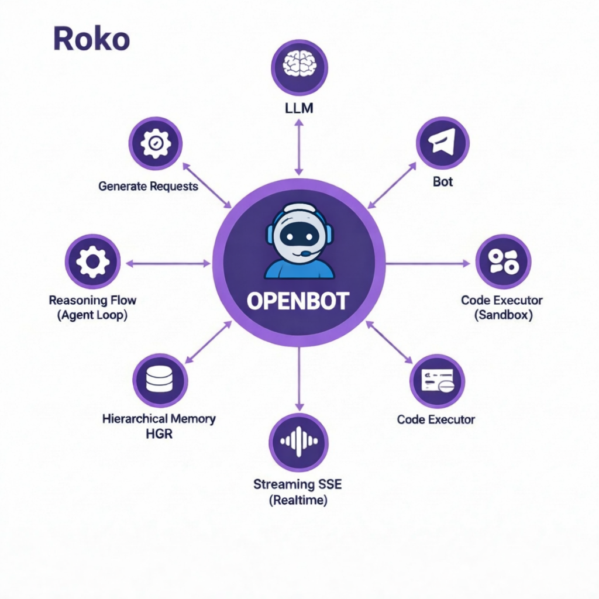

<p align="center">
  
</p>

# OPENBOT

Plataforma de agente conversacional com API assíncrona, memória HGR persistente, autenticação JWT e interface web com **streaming SSE por padrão**.

[](LICENSE)
[](#)

---

## Sumário

- [Visão geral](#visão-geral)
- [Arquitetura](#arquitetura)
- [Providers suportados](#providers-suportados)
- [Execução rápida](#execução-rápida)
- [Documentação](#documentação)
- [Segurança](#segurança)
- [Licença](#licença)

---

## Visão geral

O OPENBOT é organizado em três camadas principais:

1. **Backend Python/Quart** para autenticação, chat, tools, memória e providers.
2. **Core modular** para configuração compartilhada, providers e streaming.
3. **Frontend web** com chat, memória, crons e troca de provider em runtime.

### Destaques atuais

- Streaming SSE como modo padrão no frontend.
- Providers ativos: **DeepSeek**, **OpenAI** e **Anthropic**.
- Memória HGR persistente com SQLite.
- Login/JWT com bcrypt.
- Documentação de arquitetura, uso e roadmap.

---

## Arquitetura

```text
OPENBOT/
├── BOT/
│   ├── core/
│   │   ├── __init__.py
│   │   ├── providers.py
│   │   └── streaming.py
│   ├── routes/
│   │   └── README.md
│   ├── HGR.py
│   ├── auth_system.py
│   ├── config.py
│   ├── install.sh
│   ├── openbot.py
│   ├── openbot_cors.py
│   └── openbot_shared.py
├── WEB/
│   └── index.html
├── docs/
│   ├── guides/
│   │   ├── API.md
│   │   ├── ARQUITETURA.md
│   │   └── GUIA_USO.md
│   ├── HGR_EN.md
│   ├── HGR_ES.md
│   ├── HGR_PT.md
│   └── REFATORACAO.md
├── .env.example
├── LICENSE
└── README.md
```

---

## Providers suportados

| Provider | Variável | Modelos padrão |
|---|---|---|
| DeepSeek | `DEEPSEEK_API_KEY` | `deepseek-chat`, `deepseek-coder` |
| OpenAI | `OPENAI_API_KEY` | `gpt-4o-mini`, `gpt-4o` |
| Anthropic | `ANTHROPIC_API_KEY` | `claude-3-5-haiku-latest`, `claude-3-7-sonnet-latest` |

> O provider padrão é `deepseek`.

---

## Execução rápida

### 1. Instalação

```bash
bash BOT/install.sh
```

### 2. Servidor principal

```bash
python BOT/openbot.py
```

### 3. Servidor com CORS habilitado

```bash
python BOT/openbot_cors.py
```

### 4. Exemplo de `.env`

```env
OPENBOT_PROVIDER=deepseek
OPENBOT_MODEL=deepseek-chat
DEEPSEEK_API_KEY=
OPENAI_API_KEY=
ANTHROPIC_API_KEY=
JWT_SECRET=change-me-in-production
OPENBOT_ENV=development
OPENBOT_BASE_DIR=~/openbot_workspace
HOST=0.0.0.0
PORT=5000
CORS_ORIGINS=*
```

---

## Documentação

### Guias principais

- [Guia de uso](docs/guides/GUIA_USO.md)
- [Arquitetura](docs/guides/ARQUITETURA.md)
- [API](docs/guides/API.md)
- [Plano de refatoração](docs/REFATORACAO.md)
- [Memória HGR em português](docs/HGR_PT.md)

---

## Segurança

- Nunca publique segredos reais no repositório.
- Em produção, use `JWT_SECRET` forte e CORS restrito.
- Rotacione imediatamente qualquer token exposto.
- O frontend foi reforçado para lidar com falhas de streaming sem quebrar a sessão de chat.

---

## Licença

Este projeto é distribuído sob a **Apache License 2.0**. Veja [`LICENSE`](LICENSE).
